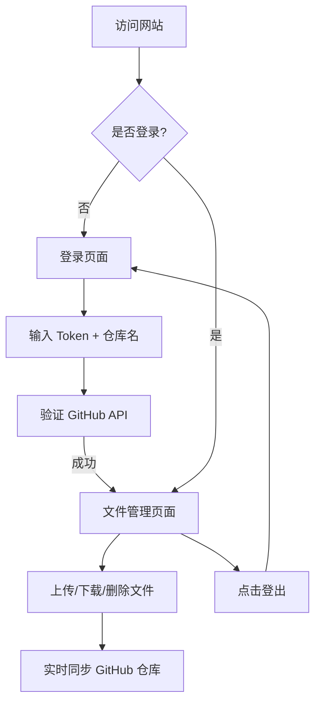

## 1. 产品概述

一个基于 GitHub Pages + GitHub API 的个人文件存储网站，使用 GitHub Personal Access Token 登录，文件存储在用户自己的 GitHub 仓库中，真正实现跨设备同步。亮点是快速登录、一键登出、文件云同步。

- 主要用途：个人文件存储和跨设备访问
- 目标用户：个人用户自用，有 GitHub 账号
- 核心价值：快速、安全、免费的个人云存储方案

## 2. 核心功能

### 2.1 用户角色
| 角色 | 登录方式 | 核心权限 |
|------|----------|----------|
| 用户 | GitHub Token 登录 | 上传、下载、管理个人文件 |

### 2.2 功能模块
1. **登录页面**：输入 GitHub Token 和仓库名，快速登录
2. **文件管理页面**：文件列表、上传、下载、删除
3. **导航栏**：显示用户名和仓库名，一键登出按钮

### 2.3 页面详情
| 页面名称 | 模块名称 | 功能描述 |
|----------|----------|----------|
| 登录页面 | 登录表单 | 输入 GitHub Token 和仓库名登录，附带 Token 获取说明 |
| 文件管理 | 文件列表 | 从 GitHub 仓库读取文件，支持下载和删除 |
| 文件管理 | 上传组件 | 拖拽或点击上传文件，自动推送到 GitHub 仓库 |
| 导航栏 | 用户信息 | 显示 GitHub 用户名和仓库，一键登出按钮 |

## 3. 核心流程

用户访问网站 → 未登录则跳转到登录页 → 输入 GitHub Token 和仓库名 → 验证成功后进入文件管理页 → 上传/下载/删除文件（实时同步到 GitHub） → 点击登出按钮退出登录

## 4. 用户界面设计

### 4.1 设计风格
- 主色调：深蓝色 (#1e3a5f)
- 辅助色：天蓝色 (#3b82f6)
- 按钮样式：圆角、渐变效果
- 字体：Inter，现代简洁
- 布局：卡片式布局，清晰的视觉层次
- 图标：Lucide 图标库

### 4.2 页面设计概述
| 页面名称 | 模块名称 | UI 元素 |
|----------|----------|----------|
| 登录/注册 | 表单区域 | 居中卡片、渐变背景、输入框带图标 |
| 文件管理 | 文件列表 | 卡片式文件项、操作按钮、文件图标 |
| 文件管理 | 上传区域 | 拖拽区域、点击上传提示 |
| 导航栏 | 顶部导航 | Logo、用户名、登出按钮 |

### 4.3 响应式设计
- 桌面优先设计
- 移动端自适应布局
- 触控优化的按钮尺寸
