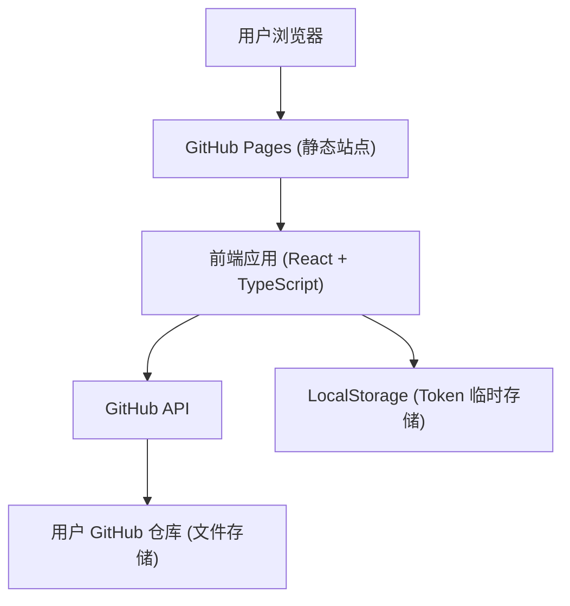

## 1. 架构设计



## 2. 技术说明

- 前端：React@18 + TypeScript + TailwindCSS@3 + Vite
- 状态管理：Zustand
- 路由：React Router DOM
- 图标：Lucide React
- 文件存储：GitHub 仓库 (通过 GitHub API)
- Token 存储：LocalStorage (登出即清除)
- 部署：GitHub Pages (main 分支)

## 3. 路由定义

| 路由 | 用途 |
|------|------|
| / | 文件管理首页 |
| /login | 登录页面 |

## 4. 数据模型

### 4.1 用户数据模型
```typescript
interface User {
  login: string;     // GitHub 用户名
  token: string;     // GitHub Personal Access Token
  repo: string;      // 仓库名 (owner/repo 格式)
  avatarUrl: string; // 头像 URL
}
```

### 4.2 文件数据模型
```typescript
interface FileItem {
  path: string;       // 文件路径
  name: string;       // 文件名
  sha: string;        // 文件 SHA (用于删除/更新)
  size: number;       // 文件大小
  type: string;       // 文件类型
  downloadUrl: string; // 下载链接
  uploadedAt: string; // 上传时间
}
```

## 5. 核心组件结构

```
src/
├── components/
│   ├── Navbar.tsx          # 导航栏
│   ├── FileCard.tsx        # 文件卡片
│   ├── FileList.tsx        # 文件列表
│   └── UploadArea.tsx      # 上传区域
├── pages/
│   ├── Home.tsx            # 文件管理首页
│   └── Login.tsx           # 登录页面
├── stores/
│   └── authStore.ts        # 认证状态管理
├── utils/
│   └── githubApi.ts        # GitHub API 工具
├── App.tsx
└── main.tsx
```

## 6. GitHub API 调用说明

### 验证 Token
- GET https://api.github.com/user
- Header: Authorization: token {token}

### 获取文件列表
- GET https://api.github.com/repos/{owner}/{repo}/contents/{path}

### 上传文件
- PUT https://api.github.com/repos/{owner}/{repo}/contents/{path}
- Body: { message, content (base64), branch }

### 删除文件
- DELETE https://api.github.com/repos/{owner}/{repo}/contents/{path}
- Body: { message, sha, branch }

## 7. 安全性考虑

- Token 仅存储在 LocalStorage，登出立即清除
- 所有 API 调用通过 HTTPS
- 用户完全控制自己的数据和 Token
- 推荐使用 Fine-grained Personal Access Token，仅授予指定仓库的读写权限
